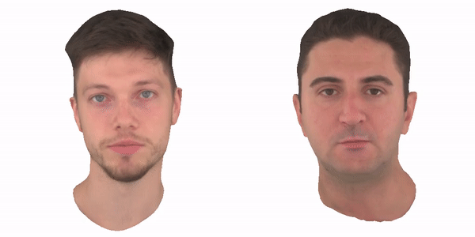

# An Implementation of Neural Head Avatars from Monocular RGB Videos

This is an implementation of neural head avatars. 
The code is heavily based on [this repo NerFace](https://github.com/gafniguy/4D-Facial-Avatars) [CVPR 2021] and [this repo Neural Head Avatar](https://github.com/philgras/neural-head-avatars) [CVPR 2022]. The target is to extrapolate unseen poses and view points of an animatable human avatar from a monocular RGB portrait video including a range of different expressions and views. 



We here provide 2 ways to re-produce this implementation, and the installation can be found [docs/Install.md](https://github.com/YHDING23/Imp_NeuAvatar/blob/main/docs/Install.md). 


## Training an Avatar against your own video

To train a new avatar from scratch against a monocular .mp4 video, please follow these steps and make sure i) only one subject is visble in every frame, and ii) the head is turned in both directions to provide enough information. 

### Step 0. Data and Pretrained models
It is an optional step in case you need a quickstart via pretrained model. 

- Download pretrained models from [external website](https://edmond.mpdl.mpg.de/api/access/datafile/182303) or [our NFS]() `/nfs_2/YHDING/ckpts_and_data.tar.gz`. The folder layout:
```angular2html
    ckpts_and_data/
    ├── data   # frame-by-frame tracking results (face normal, parsing, landmark detection, etc.) from two subjects 
        ├── person_0000
        ├── person_0004
    ├── nha    # the pretrained models from two subjects
    ├── tracking    # the head tracking files (.npz)
```
Please note, [our NFS]() ```/nfs_2/Avatar/``` includes 1) pretrained model and data, 2) flame model setup and 3) head tracker setup for a quick star of training. 

### Step 1. Preprocessing
Ensure after your installation, the following folders and models are listed under your workspace
- ```deps/face_normals```, it crops the input images into the fixed size around the face. 
- ```deps/face_parsing```, here we use this model for facial segmentation. 
- ```deps/rvm```, here we use this model for background matting. 

After the above, you can run 
```
python python_scripts/video2dataset.py --video PATH_TO_VIDEO.mp4 --out_path PATH_TO_OUTPUT_DIR
```
This script will automatically extract all necessary data including segmentations, normal maps and so on. While not being strictly necessary, we recommend using square videos captured at 25 fps at a resolution of 512x512 px.

### Step 2. Head Tracking
- This is a submodule we have to install, separately. 
```
cd deps/video-head-tracker 
pip install -e .
```
Ensure you have the flame head model ```generic_model.pkl``` and the uv parametrization ```head_template_mesh.obj``` of FLAME under ```./assets/flame```. Then run 
```
python deps/video-head-tracker/vht/optimize_tracking.py --config configs/tracking.ini --data_path PATH_TO_OUTPUT_DIR/
```
Here, the `data_path` is from the `out_path` in Step 1. Change the configuration file, accordingly. Also, if you point Tensorboard to `output_path`, you can follow the optimization. 

### Step 3. Avatar Optimization

Ensure you have the arcface model weights used for the perceptual energy term as ```backbone.pth``` in ```./assets/InsightFace```. Then run
```
python python_scripts/optimize_nha.py --config configs/optimize_avatar.ini
```
After the optimization is finished, the trained model is stored in the directory specified via ```default_root_dir``` alongside with qualitative and quantitative evaluations.

### Demos

- Download related `flame` setup from [our NFS]() ```/nfs_2/Avatar/assets```, and put the folder under your `NeuAvatar\`. Then run 

- run ```jupyter notebook jupyter_notebooks```, and find notebooks to run
  - Notebook 1. Manually adjust expression and pose parameters 
  - Notebook 2. Video-to-Video reenactment
  - Notebook 3. real-time reenactment (ongoing)

Please note in docker installation, you can simply mount the `/nfs_2/Avatar/` to your workspace with everything included.  

### Customize Training Parameters

- Adapt the split config file at ```configs/split.json``` to specify which frames to use for training and which for validation

- Adapt the config file at ```configs/optimize_avatar.ini``` according to your needs. Make sure to change the parameters:

      default_root_dir ... Path to directory to store the results in (e.g. experiments/optimized_avatars)

      data_path ... Path to dataset (e.g. data/own_dataset)

      split_config ... Path to split config (e.g. configs/split.json)

      tracking_results_path``` ... Path to the file containing the tracked flame parameters (e.g. data/own_dataset/tracking_results/tracking_1/tracked_params.npy)

- If you desire to make any changes to the other parameters please note two details:

   * The parameters ```train_batch_size, validation_batch_size, *_lr``` and most of the loss weights are defined as tuples of three values. Each value corresponds to one stage of optimization, namely, geometry optimization, texture optimization, and joint optimization respectively.

   * The parameters ```w_semantic_hair, w_silh, w_lap``` change smoothly during training and are specified through lists of tuples with two entries. The first tuple entry specifies the weight value, the second specifies the epoch. Inbetween the so-defined fixpoints, the values are interpolated.


## Acknowledgements

**Please include the following citation:**

```
@article{Gafni_2021_CVPR,
    title     = {Dynamic Neural Radiance Fields for Monocular 4D Facial Avatar Reconstruction},
    author    = {Gafni, Guy and Thies, Justus and Zollh{\"o}fer, Michael and Nie{\ss}ner, Matthias},
    booktitle = {Proceedings of the IEEE/CVF Conference on Computer Vision and Pattern Recognition (CVPR)},
    month     = {June},
    year      = {2021},
    pages     = {8649-8658}
        }

```


```
@article{grassal2021neural,
  title      = {Neural Head Avatars from Monocular RGB Videos},
  author     = {Grassal, Philip-William and Prinzler, Malte and Leistner, Titus and Rother, Carsten and Nie{\ss}ner, Matthias and Thies, Justus},
  journal    = {arXiv preprint arXiv:2112.01554},
  year       = {2021}
}

```


